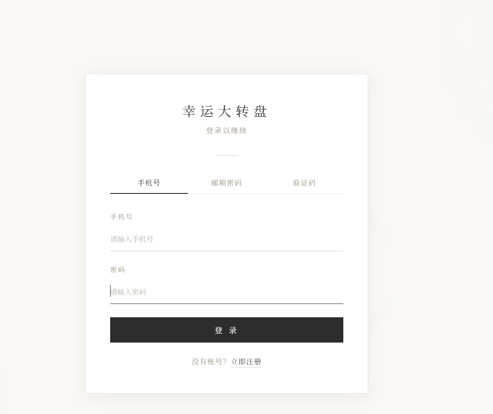
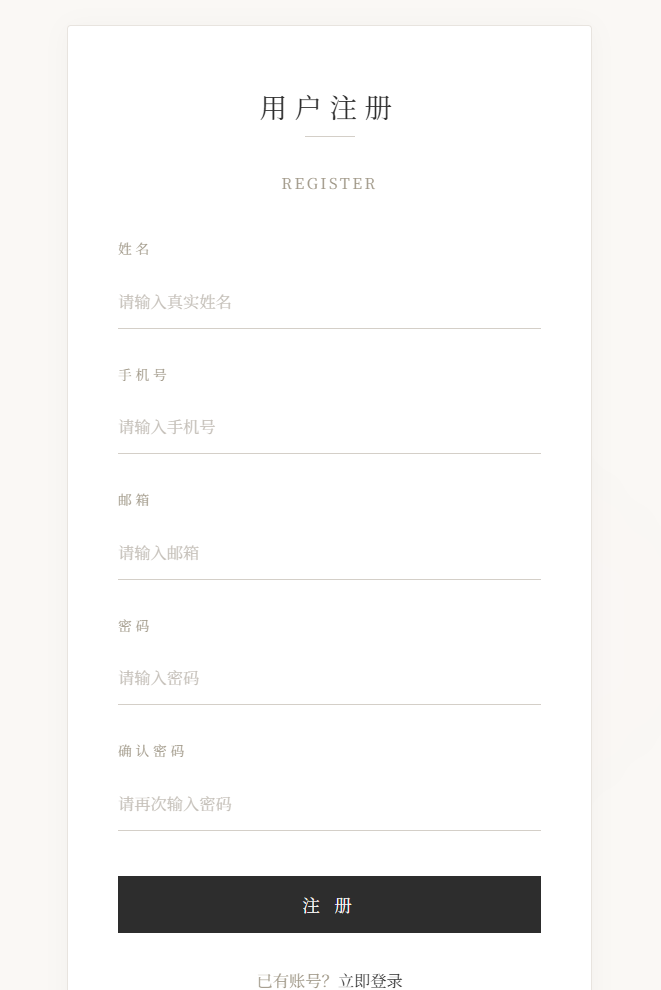
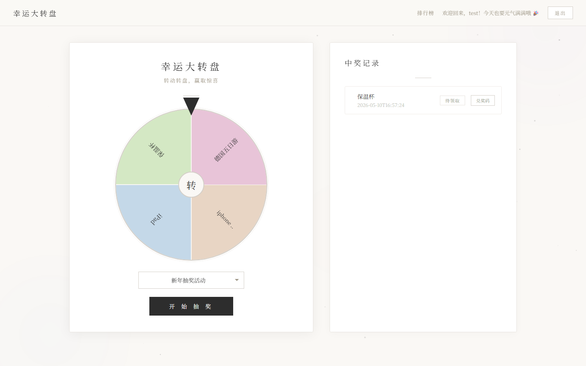
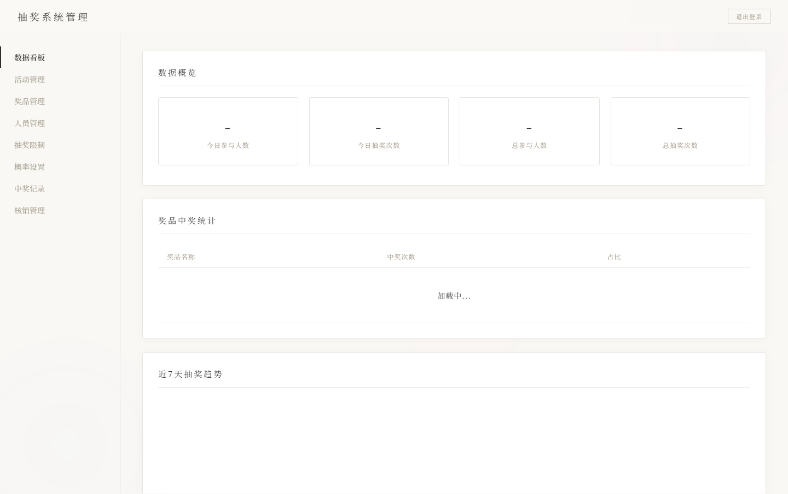
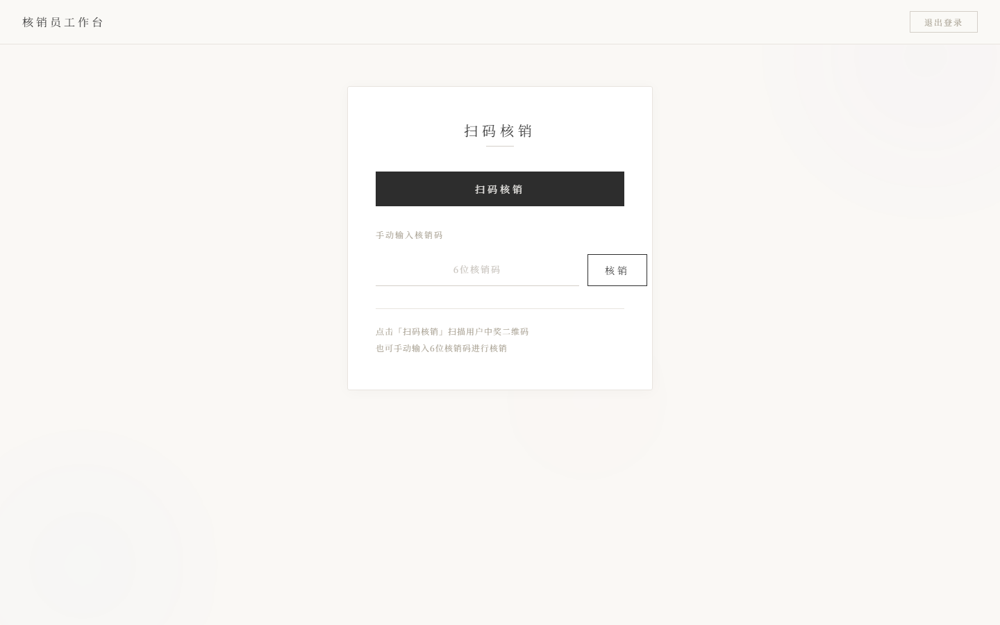

# Lucky Spin - 幸运大转盘抽奖系统

基于 Spring Boot 的企业级抽奖系统，支持多角色（用户/管理员/核销员）协同操作，涵盖活动管理、概率抽奖、库存扣减、二维码核销、AI 智能客服等完整业务闭环。

适合作为计算机专业实习/校招的简历项目展示。

## 项目截图

<table>
<tr>
<td align="center"><b>登录页</b></td>
<td align="center"><b>注册页</b></td>
</tr>
<tr>
<td></td>
<td></td>
</tr>
<tr>
<td>支持手机号 / 邮箱 / 验证码三种登录</td>
<td>手机号 / 邮箱注册</td>
</tr>
<tr>
<td align="center"><b>用户抽奖页</b></td>
<td align="center"><b>后台管理页</b></td>
</tr>
<tr>
<td></td>
<td></td>
</tr>
<tr>
<td>Canvas 转盘 + 欢迎语 + 中奖记录</td>
<td>数据看板 + 活动 / 奖品 / 概率管理</td>
</tr>
<tr>
<td align="center" colspan="2"><b>核销员工作台</b></td>
</tr>
<tr>
<td align="center" colspan="2"></td>
</tr>
<tr>
<td align="center" colspan="2">扫码核销 / 手动输入核销码</td>
</tr>
</table>

## 技术栈

| 层级 | 技术选型 |
|------|---------|
| 核心框架 | Spring Boot 2.7.14 |
| ORM | MyBatis（注解方式） |
| 数据库 | MySQL 8.0 |
| 缓存 | Redis（降级策略：不可用时自动回退 DB） |
| 密码加密 | BCrypt（Spring Security Crypto） |
| 邮件服务 | Spring Mail + QQ邮箱 SMTP |
| 二维码 | ZXing（生成 + 解码） |
| Excel 导出 | Apache POI |
| AI 集成 | OkHttp + Fastjson2 调用大模型 API |
| 实时通信 | WebSocket |
| 简化代码 | Lombok |
| 工具库 | Hutool |
| 前端 | HTML5 + CSS3 + Canvas + Vanilla JS（暗色霓虹主题） |

## 系统角色

| 角色 | 功能 |
|------|------|
| **用户 (USER)** | 注册/登录（手机号+密码、邮箱+密码、邮箱+验证码）、抽奖、查看中奖记录、AI 客服 |
| **管理员 (ADMIN)** | 活动 CRUD、奖品管理、奖品池概率配置、抽奖次数限制、数据统计图表、Excel 导出、AI 活动分析 |
| **核销员 (CLAIMER)** | 扫码核销、核销码查询 |

## 项目架构

```
src/main/java/com/example/lotterysystem/
├── LotterySystemApplication.java    # 启动类
├── common/
│   ├── result/
│   │   ├── ApiResponse.java         # 统一响应包装
│   │   └── ResultCode.java          # 状态码枚举
│   └── exception/
│       ├── BusinessException.java   # 业务异常
│       └── GlobalExceptionHandler.java # 全局异常处理
├── config/
│   ├── AsyncConfig.java             # 异步线程池配置
│   ├── RedisConfig.java             # Redis 序列化配置
│   └── WebConfig.java               # 静态资源映射 + 限流拦截器注册
├── annotation/
│   └── RateLimit.java               # 限流注解
├── interceptor/
│   └── RateLimitInterceptor.java    # 固定时间窗口限流器
├── controller/
│   ├── UserController.java          # 用户端：注册/登录/验证码
│   ├── LotteryController.java       # 用户端：抽奖/中奖记录/AI客服
│   ├── AdminController.java         # 管理后台：活动/奖品/统计/Excel
│   └── QRCodeController.java        # 二维码解码
├── service/
│   ├── LotteryService.java          # 核心抽奖算法
│   ├── AIService.java               # AI 大模型调用
│   ├── MailService.java             # 邮件发送（验证码/中奖通知）
│   ├── ScheduleService.java         # 定时任务（活动状态自动切换）
│   ├── AsyncTaskService.java        # 异步任务（抽奖计数持久化）
│   ├── UserService.java             # 用户服务接口
│   └── impl/UserServiceImpl.java    # 用户服务实现
├── entity/                          # 8个实体类（Lombok @Data）
├── mapper/                          # MyBatis 注解式 Mapper
└── utils/
    ├── PasswordUtil.java            # BCrypt 密码工具
    ├── QRCodeUtil.java              # 二维码生成
    └── QRCodeDecoder.java           # 二维码解码
```

## 核心亮点

### 1. 概率抽奖算法（累计概率区间）

```
奖品池: [A:权重30] [B:权重50] [C:权重20]
总权重 = 100
随机数 0-100: 落在 [0,30)→A, [30,80)→B, [80,100)→C
```

库存扣减使用 SQL 原子操作：`UPDATE prize SET remaining = remaining - 1 WHERE id = ? AND remaining > 0`，防止并发超发。

### 2. Redis 缓存降级策略

- 奖品池配置缓存 1 小时，减少 DB 查询
- 每日抽奖计数缓存，实时性高
- Redis 不可用时 **自动回退纯 DB 模式**，不影响核心抽奖功能

### 3. 注解式限流器

```java
@RateLimit(key = "login", time = 60, count = 10, message = "登录太频繁")
@PostMapping("/api/login/phone")
public ApiResponse<?> loginByPhone(...) { ... }
```

基于 **固定时间窗口算法**，内存 `ConcurrentHashMap` 实现，轻量且无外部依赖。

### 4. 异步线程池

```java
@Async("taskExecutor")
public void updateDrawCount(Integer userId, Integer activityId) { ... }
```

- 核心线程 2、最大 4、队列 100
- `CallerRunsPolicy` 拒绝策略：队列满时回退调用线程执行，保证任务不丢失

### 5. 统一响应格式

```json
{
  "code": 200,
  "message": "操作成功",
  "data": { "prizeName": "iPhone 17 Pro Max", "blessing": "运气爆棚！" }
}
```

所有接口统一返回 `ApiResponse<T>`，前端可据此做统一的错误处理和 Toast 提示。

### 6. 全局异常处理

`@RestControllerAdvice` 统一拦截 `BusinessException`、`IllegalArgumentException`、`Exception`，Controller 层不再写 try-catch。

### 7. 密码安全

- BCrypt 加密存储（不可逆）
- 旧数据明文密码 **自动升级**：首次登录成功后重新加密存储
- 注册/登录接口均有限流保护

## 快速启动

### 环境要求

- JDK 17+
- MySQL 8.0+
- Redis 5.0+（可选，不装会自动降级）
- Maven 3.6+

### 1. 创建数据库

```sql
CREATE DATABASE lottery_system DEFAULT CHARSET utf8mb4;
```

导入 `lottery_system.sql` 初始化表结构。

### 2. 修改配置

编辑 `src/main/resources/application.properties`：

```properties
# 数据库
spring.datasource.username=root
spring.datasource.password=你的MySQL密码

# 邮箱（QQ邮箱需使用授权码）
spring.mail.username=你的QQ邮箱@qq.com
spring.mail.password=你的SMTP授权码

# AI 接口（可选）
ai.api.key=你的API密钥
```

### 3. 启动

```bash
./mvnw spring-boot:run
```

或用 IDEA：打开项目 → Run `LotterySystemApplication`。

访问 `http://localhost:8080/blogin.html`

### 4. 默认账号

| 角色 | 手机号 | 密码 |
|------|--------|------|
| 管理员 | 13800000001 | admin123 |
| 核销员 | 13800000002 | claimer123 |
| 用户 | 13800000003 | user123 |

（需在数据库中预先插入，密码用 BCrypt 加密）

## 后续可扩展方向

- [ ] JWT 无状态认证（替代 Session）
- [ ] 分布式锁（Redis RedLock 替代 DB 行锁）
- [ ] 抽奖结果 WebSocket 实时推送
- [ ] Docker 容器化部署
- [ ] 前端改为 Vue/React SPA
- [ ] 单元测试 + 集成测试覆盖

## License

MIT
